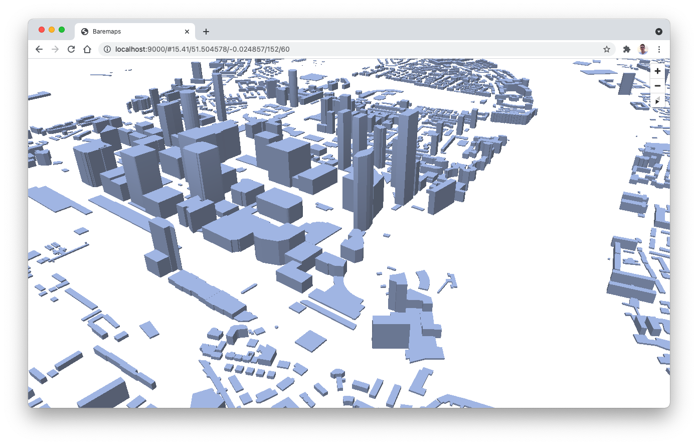

# Extrusion of vector tiles from OSM data

This example builds upon the [OpenStreetMap example](https://www.baremaps.com/examples/openstreetmap/) and shows how 3d
buildings can be extruded with Maplibre. First, start by downloading the OSM data for London in the current directory.

To import London data in the database.

```
baremaps workflow execute --file examples/extrusion/workflow.json
```

In the [tileset.json](https://raw.githubusercontent.com/apache/incubator-baremaps/main/examples/extrusion/tileset.json)
file, notice the SQL query associated with the building layer. Here, the number of levels stored in OSM is multiplied by
3, which rawly corresponds to the height of a level in meters.

```sql
SELECT id,
       tags || jsonb_build_object('building:height', (CASE
                                                          WHEN tags ->> 'building:levels' ~ '^[0-9\\.]+$'
                                                              THEN tags ->> 'building:levels'
                                                          ELSE '1' END)::real * 3),
       geom
FROM osm_ways
WHERE tags ? 'building'
```

This property is then used in
the [style.json](https://raw.githubusercontent.com/apache/incubator-baremaps/main/examples/extrusion/style.json) file to
extrude the buildings.

```json
{
  ...
  "layers": [
    {
      "id": "building",
      "type": "fill-extrusion",
      "source": "baremaps",
      "source-layer": "building",
      "paint": {
        "fill-extrusion-color": "rgb(152, 174, 221)",
        "fill-extrusion-height": [
          "get",
          "building:height"
        ],
        "fill-extrusion-base": 0,
        "fill-extrusion-opacity": 0.9
      }
    }
  ],
  ...
}
```

To preview this example, start the tile viewer. Here, the cache directive is
a [caffeine specification](https://www.javadoc.io/doc/com.github.ben-manes.caffeine/caffeine/2.2.2/com/github/benmanes/caffeine/cache/CaffeineSpec.html)
for a 100MB tile cache.

```shell
baremaps map dev \
  --database 'jdbc:postgresql://localhost:5432/baremaps?user=baremaps&password=baremaps' \
  --tileset 'tileset.json' \
  --style 'style.json'
```

Well done, a map of London with extruded buildings should now appear in your [browser](http://localhost:9000/)!




## Conclusion

In this tutorial, we learnt how to import OSM data in PostGIS with a workflow and then use the MVT specification to extrude the vector tiles into a 3d object.